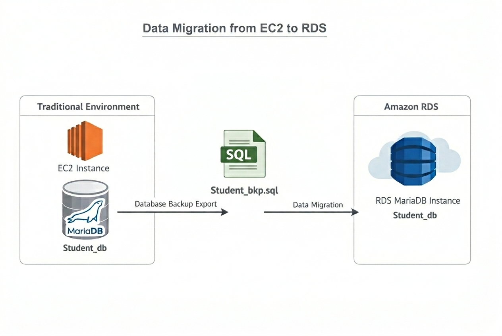
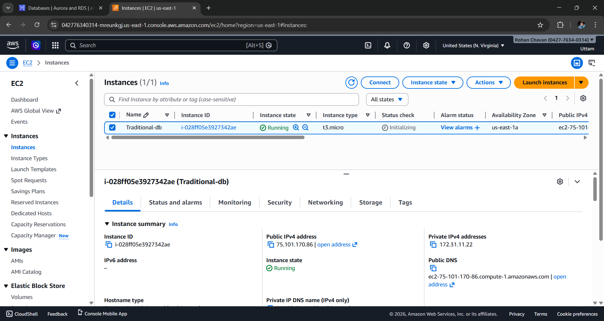
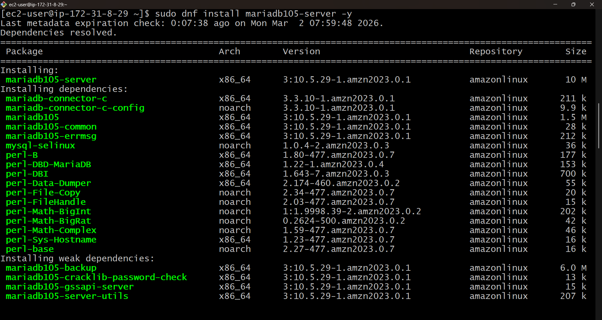
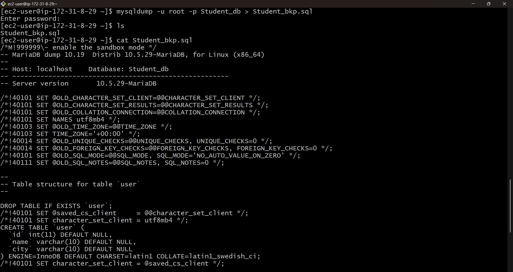
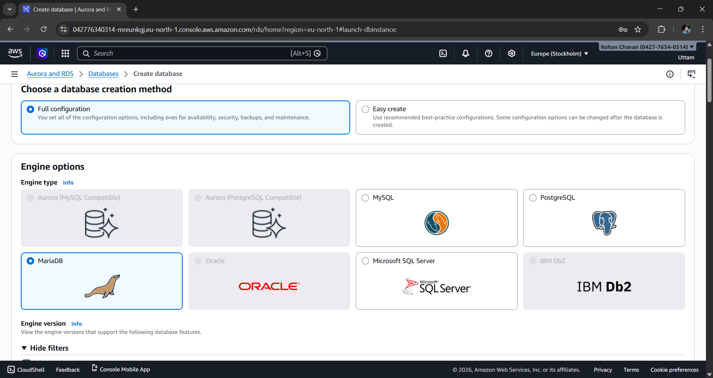
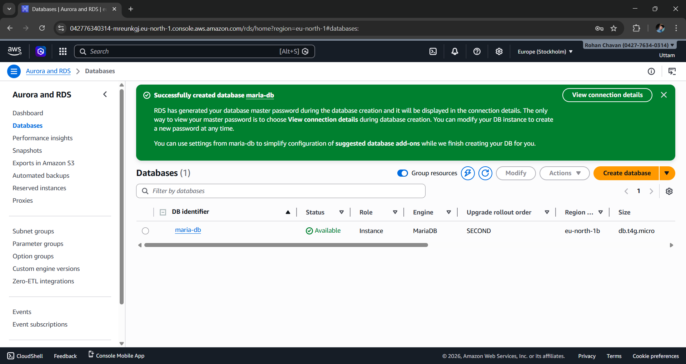
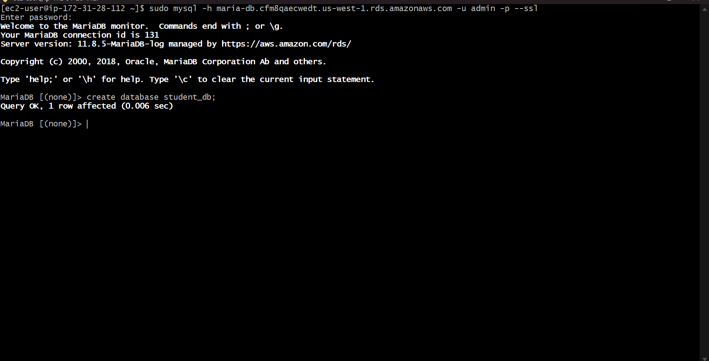
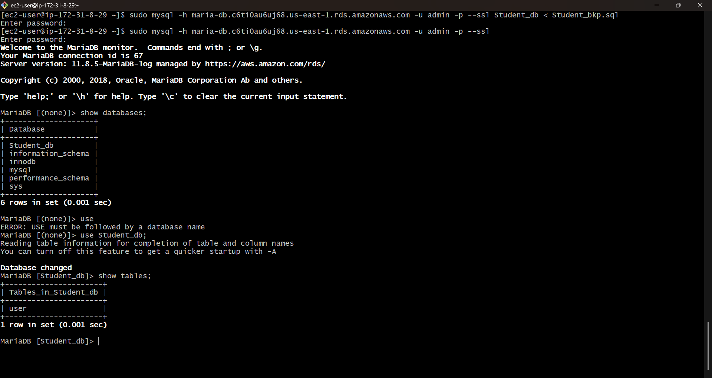
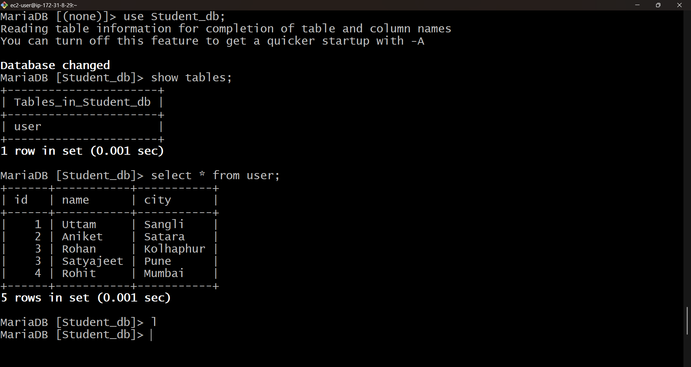

#  EC2 To AWS RDS Data Migration

## Description

 This project demonstrates how to migrate a database from an Amazon EC2 instance to Amazon RDS to improve scalability, availability, and management.
---

## Architecture Overview



This workflow outlines the end-to-end process of migrating a MariaDB database from EC2 to Amazon RDS. It includes installing and configuring MariaDB on the EC2 instance, creating and populating the source database, generating a consistent backup using mysqldump, and restoring the data into the RDS MariaDB instance. Secure connectivity between EC2 and RDS is ensured through correctly configured security group rules and MariaDB client access, enabling a smooth and reliable migration.

Key Workflow:

- Configure MariaDB on EC2

- Create and populate the source database

- Export the database using mysqldump

- Import and validate data in Amazon RDS

---


## Prerequisites

- AWS EC2 instance with SSH access
- AWS RDS MariaDB instance 
- Security Group allowing:
  - Port 22 (SSH)
  - Port 3306 (MariaDB)
- RDS endpoint, username, and password

---

## Step 1: Install MariaDB on EC2

```bash
#!/bin/bash
sudo yum update -y
sudo yum install mariadb105-server -y
sudo systemctl start mariadb
sudo systemctl enable mariadb
````





---

## Step 2: Configure Traditional MariaDB Ec2 and Create Database

```bash
sudo mysql -u root -p
```

```sql
ALTER USER 'root'@'localhost' IDENTIFIED BY <password>;
SHOW DATABASES;

CREATE DATABASE Student_db;
SHOW DATABASES;

USE Student_db;
CREATE TABLE user (
  id INT,
  name VARCHAR(10),
  city VARCHAR(10)
);

INSERT INTO user VALUES
(1, 'Uttam', 'Sangli'),
(2, 'Aniket', 'Satara'),
(3, 'Rohan', 'Kolhaphur'), 
(4, 'Satyajeet', 'Pune'), 
(5, 'Rohit', 'Mumbai')

SELECT * FROM user;
```

---

## Step 3: Backup Traditional Database

```bash
sudo mysqldump -u root -p Student_db > Student_bkp.sql
```

---

## Step 4.1: Create RDS instance

Create RDS using following configurations:






## Step 4.2: Connect to AWS RDS to EC2

```bash
sudo mysql -h <rds-endpoint> -u <rds-username> -p
```

Create a new database in RDS:

```sql
CREATE DATABASE Student_db;
```
---

## Step 5: Restore Backup to RDS

```bash
sudo mysql -h <rds-endpoint> -u <rds-username> -p Student_db < Student_bkp.sql
```


---

## Step 6: Verify Migration on RDS

```sql
SHOW DATABASES;
USE Student_db;
SHOW TABLES;
SELECT * FROM user;
```



---

## Summary

| Step             | Purpose                                                                 |
|------------------|-------------------------------------------------------------------------|
| Local DB Setup   | Install, configure, and populate the MariaDB database on the EC2 host |
| mysqldump Export | Generate a consistent logical backup of the source database            |
| RDS Import       | Restore the backup into the Amazon RDS MariaDB instance                |
| Validation       | Verify schema, tables, and data integrity after migration              |

---
## ⭐ Conclusion

This project successfully demonstrates migration of a local MariaDB database from EC2 to Amazon RDS, ensuring a smooth transition from self-managed databases to managed AWS database services.

## Contact

Author: Uttam Zure

Email: uttamzure849@gmail.com

LinkedIn: https://www.linkedin.com/in/uttam-zure-183976352